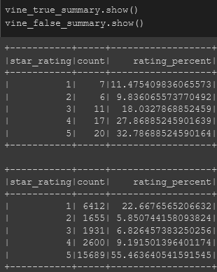
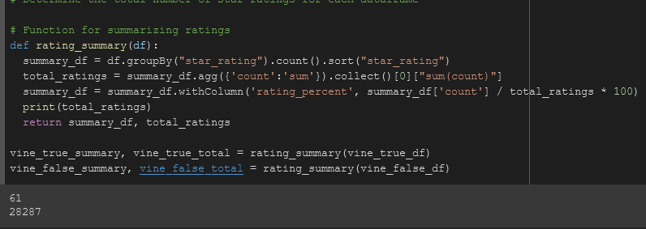

# AMAZON VINE ANALYSIS

## Overview
This project is an analysis of Amazon Marketplace grocery review data. It is an exercise in using some of the tools for working with Big Data, and makes use of PySpark, Google Colab, and AWS RDS. 

## Results
 
Overall there were many more non-Vine reviews than Vine reviews, and the Vine review ratings are better distributed.

<!-- How many Vine reviews and non-Vine reviews were there? -->
* There were 61 Vine reviews and 28,287 non-Vine reviews.
<!-- How many Vine reviews were 5 stars? How many non-Vine reviews were 5 stars? -->
* There were 20 5 star Vine reviews and 15,689 non-Vine 5 star reviews.
<!-- What percentage of Vine reviews were 5 stars? What percentage of non-Vine reviews were 5 stars? -->
* Approximately 33% of the Vine reviews were 5 stars, and 55% of the non-Vine reviews were 5 stars.

## Summary
<!-- Is there any positivity bias for reviews in the Vine program? Use the results to support your statement. Then provide an additional analysis that you could do to with the dataset to support your statement. -->
<!-- Additional a t-test could help -->
<!-- Analysis to see if Vine reviews have an effect on non-Vine reviews. -->
According to our results there is a significantly smaller proportion of 5 star reviews in the Vine reviews, but also a larger proportion of 2, 3, and 4 star reviews. Since Amazon picks reviewers that already have a high reputation it is assumed that the Vine reviewers are already users who take the time to provide insightful reviews and ratings. Additional analysis I would perform would be to see if non-Vine reviews by users that have been selected to give Vine reviews follow the same rating distribution. 
Additionally, it would be interesting to see if products that have at least one Vine review have their rating distribution affected in the direction of the Vine review. 
